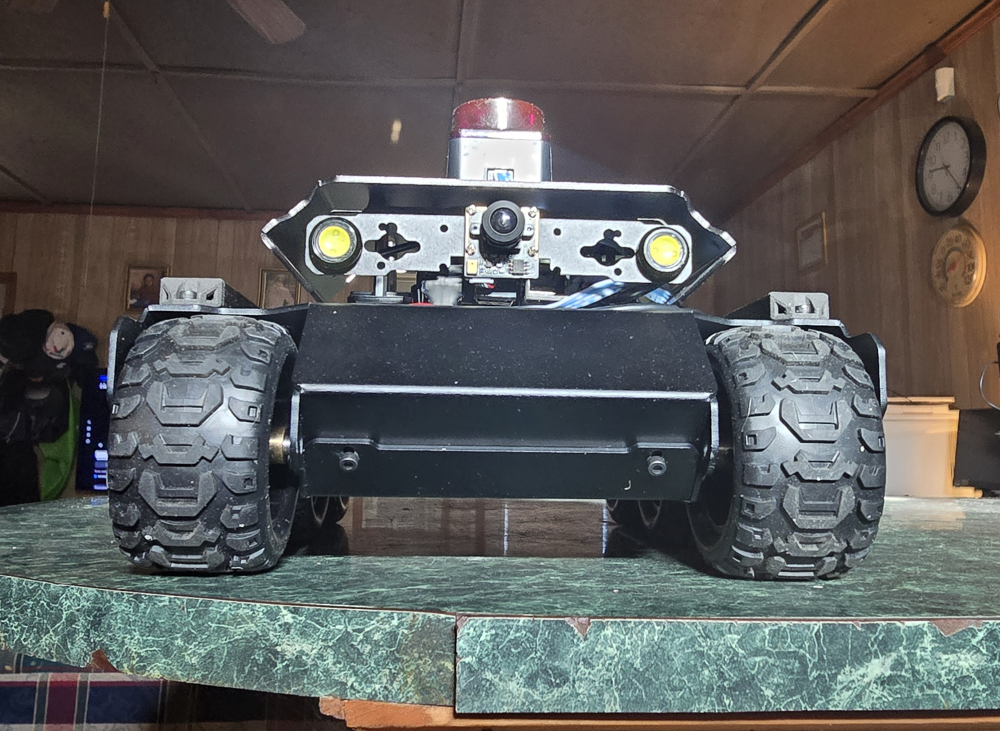

# Don's UGV Rover

My ROS2 Jazzy-based autonomous robot built on the Waveshare UGV Rover platform with custom modular packages.

## Hardware

- **Platform:** Waveshare UGV Rover
- **Computer:** Raspberry Pi 5 (Ubuntu 24.04)
- **Microcontroller:** ESP32 (motor control bridge)
- **LIDAR:** LD19 360° Laser Scanner
- **Sensors:** 
  - INA219 Battery Monitor
  - 128x64 OLED Display
- **Control:** Logitech F710 Wireless Gamepad

## Software Stack

- **OS:** Ubuntu 24.04
- **Framework:** ROS2 Jazzy
- **Navigation:** SLAM Toolbox

## Package Overview

- **rover_bringup** - Launch files, ESP32 bridge, joystick teleoperation
- **rover_description** - URDF model and robot visualization
- **rover_motion** - Odometry publishing
- **rover_msgs** - Custom messages and services (Patrol action, LED control)
- **rover_navigation** - SLAM configuration and mapping
- **rover_utils** - Battery monitoring, OLED display, safety stop
- **rover_example** - Example patrol behavior client/server

